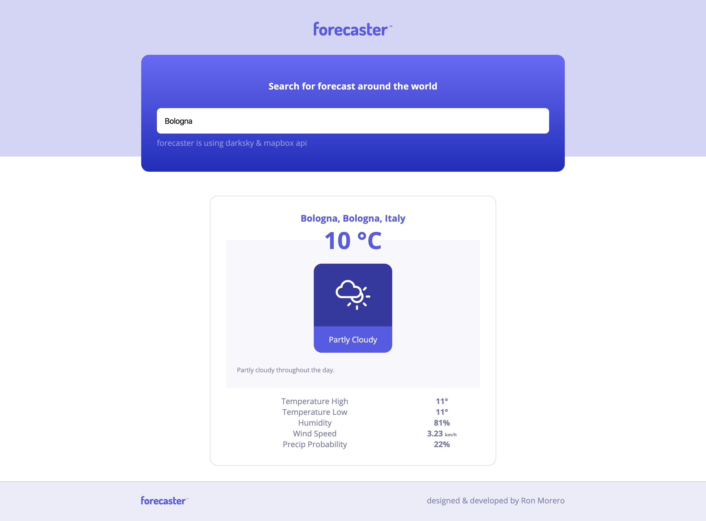

# forecaster

A small but useful app for weather information.

## Technical Info
forecaster lets the user type any location in the world, and by fetching two 3rd party APIs and chaining them together in the background, the app responeds with an informative forecast for today.

## Built with
Front-end - javascript

Back-end - Nodejs & express.js (handlebars as the template engines)

Design - original, made with Sketch

## APIs:
* [mapbox](https://www.mapbox.com) - api for fetching latitude & longitude data
* [darksky](https://www.darksky.net) - api for fetching the forecast itself (using mapbox returned data)

## Tools:
* [fontawesome](https://fontawesome.com/) - The web's most popular icon set and toolkit

## Screenshots

